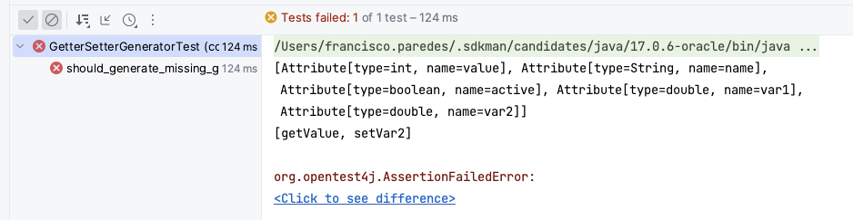

# Metaprogramando con JavaParser: La magia detrás de la generación automática de código

## ¿Qué és la metaprogramación?

La metaprogramación es un tipo de programación donde un programa es capaz de leer, modificar o incluso crear otros programas.
En esta, el programa es un *first-class citizen*.

Aunque la metaprogramación pasa desapercibida, está muy presente en nuestro día a día. Por ejemplo:

- Cuando el compilador toma como entrada el código fuente y genera un ejecutable.
- Cuando desde el IDE realizamos acciones que modifican nuestro código: extraer métodos, 
  renombrar métodos o variables, optimizar *imports*, etc.
- Cuando Sonar analiza nuestro código (sin necesidad de ejecutarlo) y genera un informe sobre él.

En resumen, en todos estos casos, un software es capaz de tomar como entrada, lo analizar y generar una salida a partir de él.

## ¿Qué és un AST?

Cuando un programa va a analizar o modificar otros programas, necesita mantener una representación de estos en su estado para poder trabajar sobre ella.
La forma más común de representar un programa es mediante un árbol, conocido como *AST* (del inglés *Abstract Syntax Tree*).

El *AST* varía en función del lenguaje de programación que se esté utilizando.
En el caso de un programa en Java, el elemento raíz del AST es la unidad de compilación (que corresponde a cada fichero Java).

De la raíz se desprenden los distintos nodos que corresponden a la declaración del paquete, el listado de imports, o la declaración de la clase, interfaz o enumerado, según corresponda.
De cada clase, a su vez, se desprenden nodos correspondientes a atributos, constructores, métodos, clases internas, etc.
Y así sucesivamente, desglosando el código fuente completo hasta llegar a las hojas del árbol, que corresponden a elementos como modificadores, identificadores, tipos, etc.

Por ejemplo, partiendo de la siguiente clase de ejemplo:

```java
package com.tutorial.example;

public class Producto {

    private final String nombre;
    private final double precio;
    private final int cantidad;

    public Producto(String nombre, double precio, int cantidad) {
        this.nombre = nombre;
        this.precio = precio;
        this.cantidad = cantidad;
    }

    public double calcularPrecioTotal() {
        double total = precio * cantidad;

        if (total > 100) {
            total = total * 0.9;
        }

        return total;
    }
}
```

El *AST* que representa dicho programa es el siguiente: 


Todo el código de la clase tiene su representación dentro del *AST*. Al transformar este árbol (añadiendo, modificando o eliminando nodos),
podemos cambiar el código fuente de un programa por otro, según nuestras necesidades.


## JavaParser

[JavaParser](https://javaparser.org/) es una librería de código abierto que permite analizar, transformar y generar código Java.

Para hacer uso de la librería podemos importarla a través de Maven:

```xml
<dependency>
    <groupId>com.github.javaparser</groupId>
    <artifactId>javaparser-symbol-solver-core</artifactId>
    <version>3.26.2</version>
</dependency>
```

O Gradle:

```
implementation 'com.github.javaparser:javaparser-symbol-solver-core:3.26.2'
```

### Analizando código con JavaParser

En este primer ejemplo, realizaremos un análisis del código. Para ello, parsearemos nuestra clase ```Producto.java``` y haremos algunas aserciones.

Cuando leemos un fichero Java con JavaParser, este nos devuelve un objeto que representa la *CompilationUnit*.
A través de los distintos métodos que ofrece la librería, podemos acceder a esta representación de nuestro código y hacer aserciones sobre él, tal como se muestra en el código a continuación.


```java
@Test
void class_should_be_parsed() {
    // Leemos el fichero java en un objecto File
    InputStream file = this.getClass().getClassLoader().getResourceAsStream("pre/Producto.java");
    
    // Parseamos el fichero con JavaParser y obtenemos la representación de nuestro código
    CompilationUnit compilationUnit = StaticJavaParser.parse(file);
    
    // Assert 1. Verificar que el objecto CompilationUnit devuelto por JavaParser no es nulo
    assertNotNull(compilationUnit);
    
    // Assert 2. Verificar que existe una clase llamada "Producto" dentro del CompilationUnit
    ClassOrInterfaceDeclaration productClass = compilationUnit.getClassByName("Producto").orElseThrow()
    assertEquals("Producto", productClass.getNameAsString());
    
    // Assert 3. Comprobar que existe un constructor dentro de la clase Producto
    assertEquals(1, productClass.getConstructors().size());
    
    // Assert 4. Comprobar que existe un método llamado "calcularPrecioTotal"
    assertTrue(productClass.getMethods().stream().anyMatch(m -> m.getNameAsString().equals("calcularPrecioTotal")));
    // Assert 5. Comprobar que existe un atributo de la clase que se llama "nombre" y es de tipo "String
    assertFieldExistsWithNameAndType(productClass, "nombre", "String");
    // Assert 6. Comprobar que existe un atributo de la clase que se llama "precio" y es de tipo "double"
    assertFieldExistsWithNameAndType(productClass, "precio", PrimitiveType.doubleType().asString());
    // Assert 7. Comprobar que existe un atributo de la clase que se llama "cantidad" y es de tipo "int"
    assertFieldExistsWithNameAndType(productClass, "cantidad", PrimitiveType.intType().asString());
}

private void assertFieldExistsWithNameAndType(ClassOrInterfaceDeclaration classOrInterfaceDeclaration, String name, String typeName) {
    var exists = classOrInterfaceDeclaration
            .getFields()
            .stream()
            .anyMatch(fieldDeclaration ->
                    fieldDeclaration.getElementType().asString().equals(typeName)
                    && existsVariableWithName(fieldDeclaration.getVariables(), name)
            );
    assertTrue(exists);
}

private boolean existsVariableWithName(List<VariableDeclarator> fields, String name) {
    return fields.stream().anyMatch(variableDeclarator -> variableDeclarator.getNameAsString().equals(name));
}
```

### Generando código automáticamente con JavaParser

A continuación, realizaremos un segundo ejemplo en el que modificamos el código Java utilizando la librería.

Para ello, partimos de la siguiente clase:

```java
package com.example;

public class Example {
  private final int value;
  private String name;
  private boolean isActive;
  private double var1, var2;

  public Example(int value) {
    this.value = value;
  }

  public int getValue() {
    return value;
  }

  public void setVar2(double var2) {
    this.var2 = var2;
  }
}
```

Nuestro objetivo será generar automáticamente los getters y setters (que no existan) para todos los atributos de la clase mediante código Java.

La clase esperada tras aplicar nuestro código sería la siguiente:

```java
package com.example;

public class Example {

    private int value;
    private String name;
    private boolean active;
    private double var1, var2;
  
    public Example(int value) {
        this.value = value;
    }
  
    public int getValue() {
        return value;
    }
  
    public void setValue(int value) {
        this.value = value;
    }
  
    public String getName() {
        return name;
    }
  
    public void setName(String name) {
        this.name = name;
    }
  
    public boolean getActive() {
        return isActive;
    }
    
    public void setActive(boolean active) {
        this.active = active;
    }
    
    public double getVar1() {
        return var1;
    }
    
    public void setVar1(double var1) {
        this.var1 = var1;
    }
  
    public double getVar2() {
        return var2;
    }
  
    public void setVar2(double var2) {
        this.var2 = var2;
    }
}
```

Por lo tanto, lo primero que haremos será desarrollar un test para comprobar la funcionalidad requerida:


```java
public class GetterSetterGeneratorTest {

    private final GetterSetterGenerator getterSetterGenerator = new GetterSetterGenerator();

    @Test
    void should_generate_missing_getter_and_setter() {
        CompilationUnit compilationUnit = loadCompilationUnitFromResourceFile("pre/Example.java");

        CompilationUnit modified = getterSetterGenerator.generate(compilationUnit);

        CompilationUnit expectedCompilationUnit = loadCompilationUnitFromResourceFile("post/Example.java");
        assertEquals(expectedCompilationUnit, modified);
    }

    private CompilationUnit loadCompilationUnitFromResourceFile(String path) {
        var expected = this.getClass().getClassLoader().getResourceAsStream(path);
        return StaticJavaParser.parse(expected);
    }
}
```
En esta primera iteración, intentaremos obtener los nombres y tipos de todos los atributos que contiene la clase.
Para ello, necesitamos recorrer el *AST* de nuestro programa, y cada vez que nos encontremos con la declaración de un atributo, 
lo almacenaremos en una lista para generar los métodos posteriormente.

Del mismo modo, por cada método, obtendremos el nombre para ver si coincide con alguno de los que necesitamos generar y, de ese modo, evitar generarlo por duplicado.

Para recorrer el *AST* JavaParser proporciona una implementación del patrón *[Visitor](https://refactoring.guru/design-patterns/visitor)* 
con una implementación por defecto que recorre el AST llamado *[VoidVisitorAdapter](https://github.com/javaparser/javaparser/blob/master/javaparser-core/src/main/java/com/github/javaparser/ast/visitor/VoidVisitorAdapter.java)*, 
por lo que no es necesario implementar el algoritmo para recorrer el *AST*.
Podemos sobrescribir los métodos de dicha clase para que cada vez que se visite un nodo del *AST* de un tipo concreto almacene la información necesaria.

Con esto, podemos generar una primera implementación de nuestro código:

 ```java
public class GetterSetterGenerator {

    private final VoidVisitor<Void> visitor = new VoidVisitorAdapter<>() {
    
        private final List<Attribute> attributes = new ArrayList<>();
        private final List<String> methodNames = new ArrayList<>();
    
        @Override
        public void visit(FieldDeclaration n, Void arg) {
            // Debemos almacenar el nombre de la variable y el tipo de la misma 
            // para poder generar posteriormente los getters y setters con el tipo de datos correcto
            n.getVariables().forEach(v -> this.attributes.add(new Attribute(v.getType(), v.getNameAsString())));
        }
    
        @Override
        public void visit(MethodDeclaration m, Void arg) {
            methodNames.add(m.getNameAsString());
        }
    
        @Override
        public void visit(ClassOrInterfaceDeclaration n, Void arg) {
            // Primero visitamos el arbol entero para recorrer todos los nodos del AST y que se poblen las variables
            // con la información de la clase.
            super.visit(n, arg);
    
            System.out.println(attributes);
            System.out.println(methodNames);
        }
    };
    
    
    private record Attribute(Type type, String name) {}
    
    public CompilationUnit generate(CompilationUnit compilationUnit) {
      compilationUnit.accept(visitor, null);
      return compilationUnit;
    }
}
```

Al ejecutar nuestro test vemos que hemos logrado obtener la información de los atributos y métodos de nuestra clase. 


A continuación para crear los métodos faltantes tendríamos que modificar nuestro código, creando nuevos objetos de tipo *MethodDeclaration* y añadiendolos al *ClassOrInterfaceDeclaration*.

Para crear un getter necesitamos crear un método:
1. Cuyo nombre sea ```getNombreDeLaVariable```
2. Que sea público
3. Que no tenga parametros
4. Que su cuerpo contenga un expresión de retorno del tipo "return this.**nombreDeLaVariable**"

A continuación desarrollamos el código para crear el método con JavaParser y lo añadimos a nuestra clase actual.
```java
// 0.1 Creamos el nombre del método getter que queremos crear 
String getterMethodName = "get" + upperCaseVariableName;

// 0.2 Comprobamos que no exista entre los métodos de la clase
if (!methodNames.contains(getterMethodName)) {
    
    // 1.Creamos un método y le asignamos el nombre
    MethodDeclaration getter = new MethodDeclaration();
    getter.setName(getterMethodName);
    
    // 2. Le añadimos el modificador para que sea público
    getter.setModifier(Modifier.publicModifier().getKeyword(), true);
    
    // 3. Añadimos el tipo de retorno del método al tipo de la variable
    getter.setType(attribute.type);

    // 4.1 Creamos el cuerpo del método
    BlockStmt blockStmt = new BlockStmt();

    // 4.2 Creamos la sentencia de retorno creando una expresión para acceder al nombre de la variable dentro del contexto "this" 
    ReturnStmt returnStmt = new ReturnStmt();
    returnStmt.setExpression(new FieldAccessExpr(new ThisExpr(), attributeName));

    // 4.3 Añadimos la sentencia al cuerpo del método
    blockStmt.addStatement(returnStmt);

    // Asignamos el cuerpo a nuestro nuevo método 
    getter.setBody(blockStmt);

    // Añadimos nuestor método a la clase
    classOrInterfaceDeclaration.addMember(getter);
}
```

Con esto ya hemos logrado crear todos los getters de nuestra clase. Ahora vamos a realizar el mismo proceso para los setters.

Para ello necesitamos crear un método:
1. Cuyo nombre sea ```setNombreDeLaVariable```
2. Público
3. Que acepte un parametro de tipo y nombre igual al de la variable
4. Que sea ```void```
5. Cuyo cuerpo contenga una expresión de asignación del tipo ```this.nombreVariable = nombreVariable```

El código quedaría de la siguiente forma:


```java
String setterMethodName = "set" + upperCaseVariableName;
if (!methodNames.contains(setterMethodName)) {
    // 1. Creamos el método con el nombre correspondiente 
    MethodDeclaration setter = new MethodDeclaration();
    setter.setName(setterMethodName);
    
    // 2. Añadimos el modificador public
    setter.setModifier(Modifier.publicModifier().getKeyword(), true);
    
    // 3. Le añadimos un parametro con tipo y nombre correspondientes
    setter.addParameter(new Parameter(attribute.type, attributeName));
    
    // 4. Le asignamos el tipo de retorno void
    setter.setType(new VoidType());

    // 5. Creamos el cuerpo del método con una expresión de asignación
    BlockStmt blockStmt = new BlockStmt();

    AssignExpr assignExpr = new AssignExpr();
    assignExpr.setOperator(AssignExpr.Operator.ASSIGN);
    assignExpr.setTarget(new FieldAccessExpr(new ThisExpr(), attributeName));
    assignExpr.setValue(new NameExpr(attributeName));
    blockStmt.addStatement(assignExpr);

    // Añadimos el cuerpo al método
    setter.setBody(blockStmt);

    // Añadimos el método a nuestra clase
    classOrInterfaceDeclaration.addMember(setter);
}
```

Con esto, ya podemos crear de forma automática los getters y setters faltantes a nuestra clase, 
y si ejecutamos nuestro test, veremos que el test pasa.


Gracias a esto hemos modificado el *AST* de nuestro programa Java añadiendo distintos nodos para cada uno de los métodos, como se muestra en la siguiente imagen.


 ## Conclusiones


En este tutorial hemos desgranado como funcionan las herramientas de análisis y transformación de código,
hemos aprendido como estas representan internamente el código y hemos hecho un pequeño caso práctico donde 
hemos generado automáticamente *getters* y *setters* para una clase Java usando la librería JavaParser.

Por último, si quieres consultar el código utilizado para este tutorial, puedes hacerlo en el siguiente [enlace](https://github.com/PakitohWalls/javaparser-tutorial).